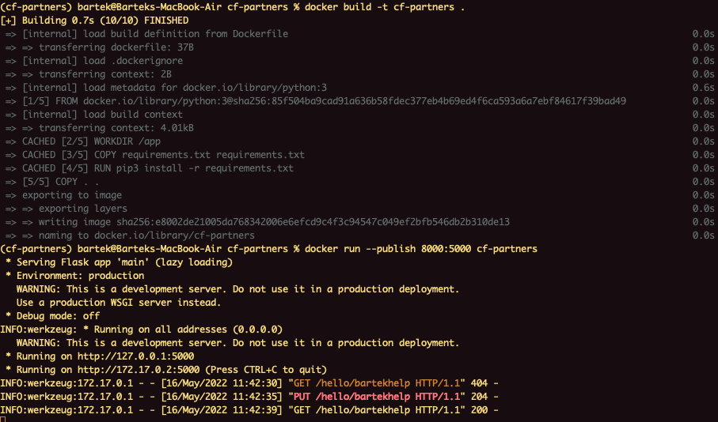
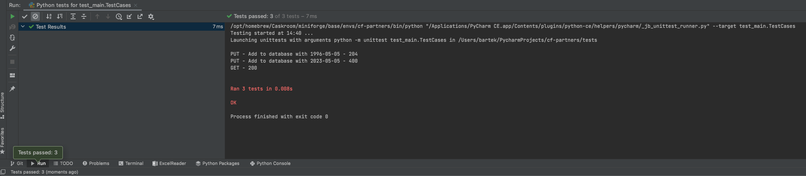
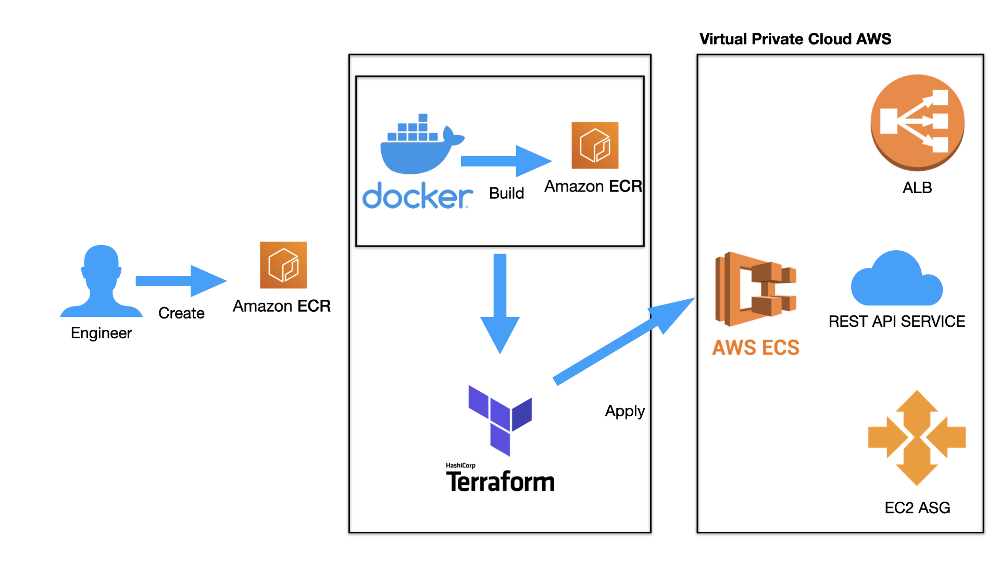

# CF Partners Home Task

## Task Description

Data Engineer Test

1. Design and code a simple "Hello World" application that exposes the following

**HTTP-based APIs:**

**Description**: Saves/updates the given user’s name and date of birth in the database.

`Request: PUT /hello/<username> { “dateOfBirth”: “YYYY-MM-DD” }`

`Response: 204 No Content`

Note: <username> must contain only letters. YYYY-MM-DD must be a date before the today date.

**Description**: Returns hello birthday message for the given user

`Request: Get /hello/<username>`

`Response: 200 OK`

Response Examples:

A. If username’s birthday is in N days:

`{ “message”: “Hello, <username>! Your birthday is in N day(s)” }`

B. If username’s birthday is today:

`{ “message”: “Hello, <username>! Happy birthday!” }`

Note: Use storage/database of your choice.

2. Produce a system diagram of your solution deployed to either Azure or AWS (it's not required to support both cloud
   platforms).
3. Write configuration scripts for building and no-downtime production deployment of this application.

Implicit requirements:

- The code produced by you is expected to be of high quality
- The solution must have tests, runnable locally, and deployable to the cloud
- Use common sense

Please put your work on github or bitbucket.

## How to run the app and test

Pre - requisites:

- Python 3
- Docker
- Terraform
- AWS Cli
- Git Client

 When pre-requisites are met, please do the following:

- Clone the repository
- Run conda/pip install on the requirements.txt
- Run `python main.py`

To test:

`cd tests`

`python test_main.py`

## Docker

- To dockerise the app run the below commands in the directory with the Dockerfile:

`docker build -t cf-partners .`

`docker run -p 8000:8000 cf-partners`

## Application build AWS

Below is the diagram of the deployment architecture:

The engineer creates the ECR for storing the docker image of the application. Docker build creates a container image of
the application, that is stored in the ECR. Terraform lays out the architecture and configuration, for automating the
deployment of the application in AWS, and applies it.

In AWS, VPS is created, with two private and two public subnets. Internet Gateway is attached to the VPC, so that it can
be accessed externally. The resources in private subnets access the internet through NAT Gateways in the public subnets.
The app is hosted on the ECS cluster running on an EC2 instance. The ECS has Auto Scaling Group and App Load Balancer.
For the database, SQLite is used locally for purpose of the assignment. Cloud Watch alerts are provided for monitoring
purposes.

---

### To deploy the app on AWS:

Type the commands below in the terminal where AWS Cli is installed.
   
`aws ecr create-repository \
--repository-name cf-partners \
--image-scanning-configuration scanOnPush=true \
--region eu-west-2`

Replace the AWS-ID with your AWS ID

Retrieve an authentication token and authenticate your Docker client to your registry. Use the AWS CLI:

`aws ecr get-login-password --region eu-west-2 | docker login --username AWS --password-stdin **<AWS-ID>**.dkr.ecr.eu-west-2.amazonaws.com
`

Note: If you receive an error using the AWS CLI, make sure that you have the latest version of the AWS CLI and Docker
installed. Build your Docker image using the following command. For information on building a Docker file from scratch
see the instructions here . You can skip this step if your image is already built:

`docker build -t cf-partners .`

After the build completes, tag your image, so you can push the image to this repository:

`docker tag cf-partners:latest **<AWS-ID>**.dkr.ecr.eu-west-2.amazonaws.com/cf-partners:latest`

Run the following command to push this image to your newly created AWS repository:

`docker push **<AWS-ID>**.dkr.ecr.eu-west-2.amazonaws.com/cf-partners:latest`

Navigate to terraform directory, run `terraform init`, `terraform plan` and `terraform apply` - in this order. This
should result in the application being deployed.
